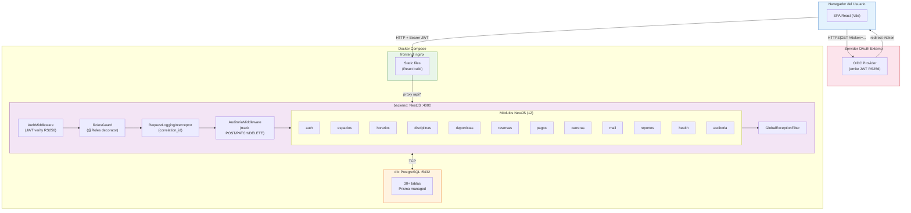
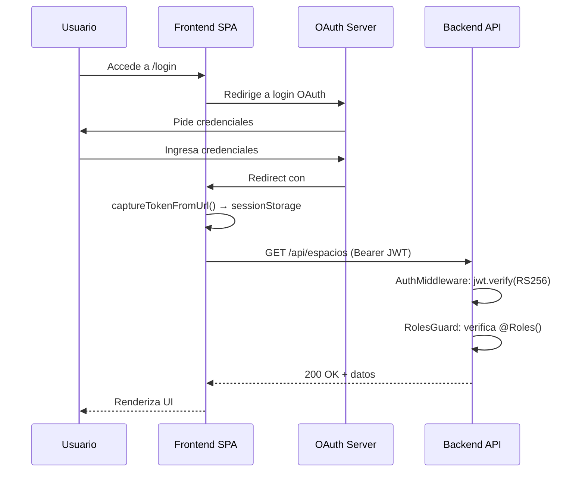

# Arquitectura del Sistema — Sistema de Gestión Deportiva UCB

> **Versión:** 1.0 | **Fecha:** Junio 2026 | **Estado:** Producción

---

## 1. Visión General

El **Sistema de Gestión Deportiva UCB** es una aplicación web full-stack diseñada para administrar la reserva de espacios deportivos, la inscripción de deportistas, el control de pagos de academias deportivas y la gestión de disciplinas deportivas de la Universidad Católica Boliviana (UCB), sede La Paz.

### 1.1 Contexto de Negocio

El Departamento de Deportes de la UCB necesita:
- Gestionar reservas de espacios deportivos evitando conflictos con horarios de clases
- Registrar y mantener información de deportistas (estudiantes UCB, academia, competitivos)
- Controlar pagos de mensualidades de academias deportivas con planillas por disciplina
- Administrar disciplinas, categorías e inscripciones
- Generar reportes y comprobantes en PDF/Excel
- Enviar confirmaciones por correo electrónico

### 1.2 Actores del Sistema

| Actor | Descripción | Roles JWT |
|---|---|---|
| **Administrador** | Gestión completa del sistema | `admin` |
| **Entrenador** | Gestión de deportistas, reservas, pagos y disciplinas | `entrenador` |
| **Delegado** | Acceso a calendario y vistas de consulta | `delegado` |
| **Deportista** | Consulta de calendario y reservas propias | `deportista` |
| **Servicio OAuth externo** | Proveedor de identidad que emite JWT RS256 | — |

---

## 2. Stack Tecnológico

| Capa | Tecnología | Versión | Propósito |
|---|---|---|---|
| **Frontend** | React + TypeScript | 18+ | UI SPA |
| **Build Frontend** | Vite | 5+ | Bundler y dev server |
| **Routing** | react-router-dom | 7 | Enrutamiento protegido por roles |
| **Backend** | NestJS + TypeScript | 10+ | API REST |
| **ORM** | Prisma | v7 | Acceso a datos tipado |
| **Base de datos** | PostgreSQL | 15 | Almacén relacional |
| **Contenedores** | Docker + Docker Compose | — | Orquestación |
| **Autenticación** | JWT RS256 (asimétrico) | — | Verificación con clave pública |
| **Email** | Nodemailer + Handlebars | — | Correos con templates |
| **Documentación API** | Swagger (OpenAPI) | — | Generada desde decorators |
| **Rate Limiting** | @nestjs/throttler | — | Protección contra abuso |
| **Reportes** | ExcelJS + PDFKit | — | Exportación Excel/PDF |
| **PDF Comprobantes** | PDFKit | — | Generación de comprobantes |

---

## 3. Diagrama de Arquitectura (C4 — Container)



---

## 4. Pipeline de Request (Backend)

Cada request HTTP atraviesa la siguiente cadena de procesamiento:

```
1. AuthMiddleware          → Verifica JWT RS256 (si hay Bearer token)
2. RolesGuard (global)     → Valida @Roles() decorator vs user.rol
3. RequestLoggingInterceptor → Genera correlation_id, log request/response
4. AuditoriaMiddleware     → Track de modificaciones (POST/PATCH/DELETE)
5. Controller              → Handler del endpoint
6. Service                 → Lógica de negocio + Prisma queries
7. GlobalExceptionFilter   → Captura y formatea errores
```

### 4.1 AuthMiddleware (`src/middleware/auth.middleware.ts`)

- Carga `public.pem` desde `src/config/`
- Si no existe y `ALLOW_DEV_MOCK=true` → modo mock (inyecta `user: { rol: "admin" }`)
- Si no existe y no hay mock → **lanza error fatal**
- Si hay token Bearer → `jwt.verify()` con algoritmo `RS256`
- Extrae `rol` de `payload.rol` o `payload.role`
- Si no hay token → `next()` (endpoints públicos siguen funcionando)

### 4.2 RolesGuard (`src/auth/guards/roles.guard.ts`)

- Guard global registrado como `APP_GUARD`
- Lee metadata `@Roles('admin', 'entrenador')` del handler/clase
- Si no hay decorator → permite acceso (endpoint público)
- Si hay decorator → compara `user.rol` (case-insensitive)
- Si no coincide → `ForbiddenException`

### 4.3 RequestLoggingInterceptor (`src/common/interceptors/request-logging.interceptor.ts`)

- Genera `correlation_id` formato `REQ-<8 hex chars>`
- Loguea: `METHOD /url STATUS (duraciónms) [correlation_id] user:email ip:ip`
- Nivel de log según status: `log` (<400), `warn` (4xx), `error` (5xx)

### 4.4 AuditoriaMiddleware (`src/auditoria/auditoria.middleware.ts`)

- Solo intercepta `POST`, `PATCH`, `DELETE`
- Entidades auditadas: `reservas`, `deportistas`, `pagos`, `disciplinas`
- Captura: usuario, rol, acción, entidad, entidad_id, IP, correlation_id
- Intercepta `res.json()` para capturar el response body como `detalle_despues`

### 4.5 GlobalExceptionFilter (`src/common/filters/global-exception.filter.ts`)

- Catch-all para todas las excepciones
- Respuesta uniforme: `{ statusCode, message, timestamp, path }`
- Logs de errores 500 con stack trace

---

## 5. Flujo de Autenticación



### 5.1 Decisiones de Seguridad

| Decisión | Razonamiento |
|---|---|
| **JWT RS256 asimétrico** | El backend solo necesita la clave pública. La privada la maneja el servidor OAuth externo. |
| **Token en `#hash`** | No se envía al servidor en el redirect. No queda en logs ni en `Referer` header. |
| **`sessionStorage`** | El token se elimina al cerrar la pestaña. Reduce ventana de ataque XSS vs `localStorage`. |
| **Expiración verificada en frontend** | `apiClient.ts` decodifica el payload JWT y verifica `exp` antes de cada request. |
| **Rate limiting** | 100 requests/minuto por IP vía `@nestjs/throttler`. |

---

## 6. Architecture Decision Records (ADRs)

### ADR-001: JWT RS256 con Proveedor Externo

**Contexto:** La UCB ya cuenta con un servidor de autenticación OAuth. No se desea duplicar gestión de credenciales.

**Decisión:** Usar JWT firmado con RSA256. El backend verifica con `public.pem`. El frontend nunca toca la clave privada.

**Consecuencias:**
- ✅ Sin gestión de passwords en el backend
- ✅ Single Sign-On con otros sistemas UCB
- ⚠️ Dependencia del servidor OAuth externo
- ⚠️ En desarrollo se requiere mock (`ALLOW_DEV_MOCK=true`)

### ADR-002: Prisma v7 como ORM

**Contexto:** Se necesita acceso tipado a PostgreSQL con migraciones versionadas.

**Decisión:** Prisma v7 con `prisma migrate dev` para migraciones y `prisma db seed` para datos iniciales.

**Consecuencias:**
- ✅ Type safety end-to-end (schema → Prisma Client → services)
- ✅ Migraciones versionadas en el repositorio
- ✅ Prisma Studio para inspección visual de la BD
- ⚠️ No se usa `prisma db push` en producción

### ADR-003: Feature-Sliced Design en Frontend

**Contexto:** El frontend tiene múltiples dominios (reservas, pagos, deportistas, etc.) que deben mantenerse aislados.

**Decisión:** Organizar por `features/<dominio>/` con subcarpetas `components/`, `pages/`, `services/`, `types/`, `mocks/`. Lo compartido va en `shared/`.

**Consecuencias:**
- ✅ Cada feature es autocontenida
- ✅ Código compartido explícito en `shared/`
- ✅ Fácil escalabilidad para nuevas features

### ADR-004: Sidecar Pattern para Emails

**Contexto:** El envío de correos no debe bloquear la respuesta HTTP al usuario.

**Decisión:** `mailService.sendReservaConfirmada().catch()` — se lanza sin await y se captura el error en el catch.

**Consecuencias:**
- ✅ El usuario recibe su respuesta inmediatamente
- ✅ Si SMTP falla, la reserva igual se crea
- ⚠️ Los errores de email solo se registran en logs

### ADR-005: Soft-Delete para Entidades Críticas

**Contexto:** Deportistas y disciplinas tienen relaciones históricas (reservas, pagos, inscripciones).

**Decisión:** Campo `activo: Boolean` en lugar de DELETE físico.

**Consecuencias:**
- ✅ Integridad referencial preservada
- ✅ Historial completo disponible
- ⚠️ Queries deben filtrar `activo: true`

### ADR-006: Planilla de Pagos como Vista Materializada

**Contexto:** El cálculo de planilla requería múltiples queries N+1.

**Decisión:** Vista `PlanillaPagosAcademia` pre-calculada que agrega pagos por deportista y gestión con columnas `mes_X_pagado`.

**Consecuencias:**
- ✅ `getPlanilla()` = 1 query + procesamiento en memoria con Map
- ✅ Eliminación del problema N+1
- ⚠️ La vista debe mantenerse sincronizada con los pagos

### ADR-007: Transacciones Atómicas en Pagos

**Contexto:** Registrar un pago implica crear el registro Y actualizar la planilla. Ambos deben ser consistentes.

**Decisión:** `prisma.$transaction()` envuelve todas las operaciones.

**Consecuencias:**
- ✅ Consistencia garantizada
- ✅ Rollback automático en caso de error

---

## 7. Patrones de Diseño Aplicados

| Patrón | Ubicación | Propósito |
|---|---|---|
| **Middleware Chain** | `AuthMiddleware` → `AuditoriaMiddleware` | Procesamiento transversal de requests |
| **Guard** | `RolesGuard` | Autorización basada en roles |
| **Interceptor** | `RequestLoggingInterceptor` | Logging con correlation_id |
| **Exception Filter** | `GlobalExceptionFilter` | Respuestas de error uniformes |
| **Decorator** | `@Roles()` | Metadata de autorización |
| **Builder** | `ComprobanteReservaBuilder` | Construcción paso a paso de PDF |
| **Repository (implícito)** | Prisma Service | Abstracción de acceso a datos |
| **Service Layer** | `*Service` en cada módulo | Lógica de negocio aislada |
| **DTO** | `dto/` en cada módulo | Validación y tipado de inputs |
| **Module** | `*Module` en cada módulo | Encapsulamiento de dependencias NestJS |

---

## 8. Estructura de Directorios

```
proyecto-grupo3/
├── docker-compose.yml          # Orquestación: db + backend + frontend
├── package.json                # Dependencias compartidas
├── README.md                   # Guía de inicio rápido
│
├── backend/
│   ├── prisma/
│   │   ├── schema.prisma       # Modelo de datos (30+ tablas)
│   │   ├── migrations/         # Migraciones versionadas
│   │   └── seed.ts             # Datos iniciales
│   ├── src/
│   │   ├── main.ts             # Entry point + bootstrap
│   │   ├── app.module.ts       # Módulo raíz (registra 12 módulos)
│   │   ├── config/
│   │   │   ├── mail.config.ts  # Configuración SMTP
│   │   │   └── public.pem      # Clave pública JWT
│   │   ├── middleware/
│   │   │   └── auth.middleware.ts      # Verificación JWT RS256
│   │   ├── common/
│   │   │   ├── constants/
│   │   │   │   └── business.constants.ts  # Constantes de negocio
│   │   │   ├── filters/
│   │   │   │   └── global-exception.filter.ts  # Error handler global
│   │   │   ├── interceptors/
│   │   │   │   └── request-logging.interceptor.ts  # Logging
│   │   │   └── utils/
│   │   │       └── response-mapper.ts    # Utilidades de respuesta
│   │   ├── prisma/
│   │   │   ├── prisma.module.ts
│   │   │   ├── prisma.service.ts
│   │   │   └── __mocks__/prisma.service.ts  # Mock para tests
│   │   ├── auth/
│   │   │   ├── auth.module.ts
│   │   │   ├── auth.controller.ts         # POST /api/auth/logout
│   │   │   ├── decorators/roles.decorator.ts
│   │   │   └── guards/roles.guard.ts
│   │   ├── espacios/           # Espacios físicos (público)
│   │   ├── horarios/           # Disponibilidad horaria (público)
│   │   ├── disciplinas/        # CRUD disciplinas (mixto)
│   │   ├── deportistas/        # CRUD deportistas + inscripciones
│   │   ├── reservas/           # Reservas + PDF + email
│   │   │   ├── pdf/
│   │   │   │   └── comprobante-reserva.builder.ts
│   │   │   └── dto/
│   │   ├── pagos/              # Pagos + planilla + morosos
│   │   ├── carreras/           # Gestión académica
│   │   ├── mail/
│   │   │   ├── mail.module.ts
│   │   │   ├── mail.service.ts
│   │   │   └── templates/
│   │   │       └── reserva-confirmada.hbs
│   │   ├── reportes/           # Exportación Excel/PDF genérica
│   │   ├── health/             # Health checks
│   │   └── auditoria/          # Tracking de modificaciones
│   └── test/                   # Tests e2e
│
├── frontend/
│   ├── src/
│   │   ├── main.tsx            # Entry point React
│   │   ├── App.tsx             # Routing + ProtectedLayout
│   │   ├── config/
│   │   │   └── routes.config.ts  # Configuración de rutas por rol
│   │   ├── hooks/
│   │   │   └── useRole.ts
│   │   ├── features/
│   │   │   ├── auth/           # Login, perfil, authStore
│   │   │   ├── dashboard/      # Dashboard admin
│   │   │   ├── calendario/     # Calendario semanal
│   │   │   ├── deportistas/    # Registro y gestión
│   │   │   ├── disciplinas/    # Gestión de disciplinas
│   │   │   ├── reservas/       # Admin y nueva reserva
│   │   │   └── pagos/          # Pagos academias
│   │   └── shared/
│   │       ├── components/     # UI reutilizable
│   │       ├── services/       # apiClient, reporteService
│   │       ├── utils/          # validators, localStore
│   │       ├── contexts/       # ToastContext
│   │       └── types/          # Tipos compartidos
│   └── public/                 # Assets estáticos
│
└── docs/                       # Documentación del proyecto
```

---

## 9. Infraestructura de Despliegue

### 9.1 Docker Compose

| Servicio | Imagen | Puerto | Dependencias |
|---|---|---|---|
| `db` | `postgres:15-alpine` | `5433:5432` | — |
| `backend` | Build multistage (Node) | `4000:4000` | `db` |
| `frontend` | Build multistage (nginx) | `80:80` | `backend` |

### 9.2 Red y Volúmenes

- **Red:** `app_network` (bridge) — todos los servicios comunican por nombre de contenedor
- **Volumen:** `postgres_data` — persistencia de PostgreSQL

### 9.3 Dockerfile Backend (multistage)

1. **Stage builder:** Instala dependencias, genera Prisma Client, compila TypeScript
2. **Stage production:** Copia solo `dist/`, `prisma/`, `package.json` y `public.pem`

### 9.4 Dockerfile Frontend (multistage)

1. **Stage builder:** Instala dependencias, build de Vite
2. **Stage production:** nginx con configuración de proxy para `/api/*` → backend

---

## 10. Consideraciones de Producción

| Aspecto | Recomendación |
|---|---|
| **Clave pública JWT** | Rotar `public.pem` cuando el servidor OAuth rote su key pair |
| **SMTP** | Usar servicio production-grade (SendGrid, AWS SES) en lugar de sandbox |
| **Base de datos** | Backups programados de PostgreSQL, conexión SSL |
| **Rate limiting** | Ajustar `ttl`/`limit` según tráfico real |
| **Logging** | Centralizar logs con ELK stack o similar |
| **Auditoría** | Revisar tabla `auditoria` periódicamente |
| **Variables de entorno** | Usar secrets manager, nunca commitear `.env` |
| **HTTPS** | Terminar SSL en nginx (frontend) y usar reverse proxy al backend |
